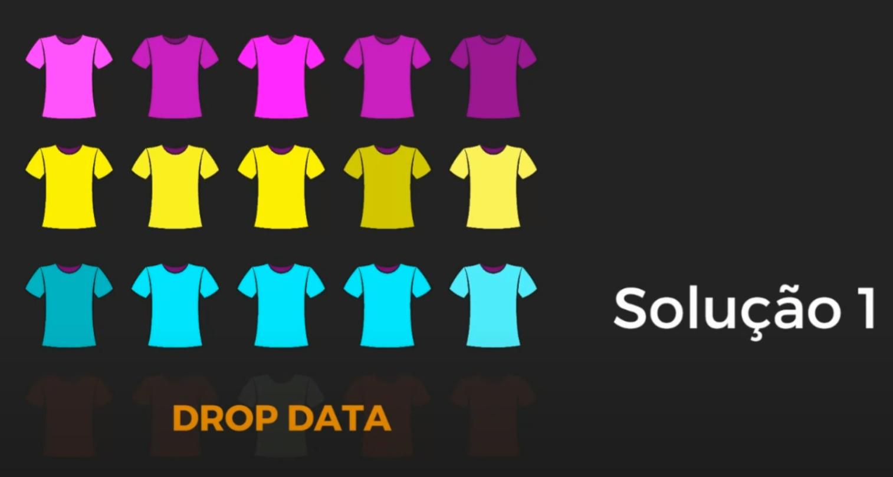
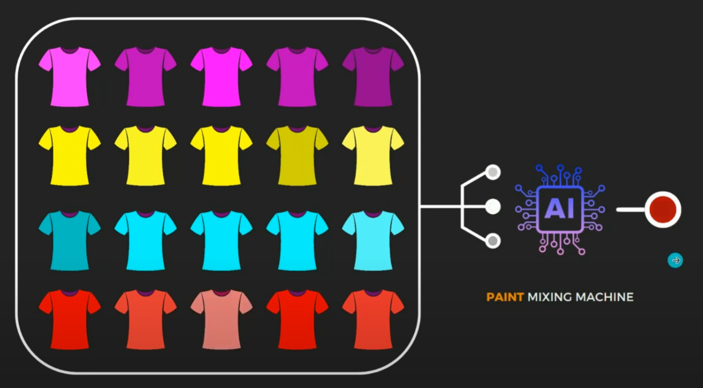
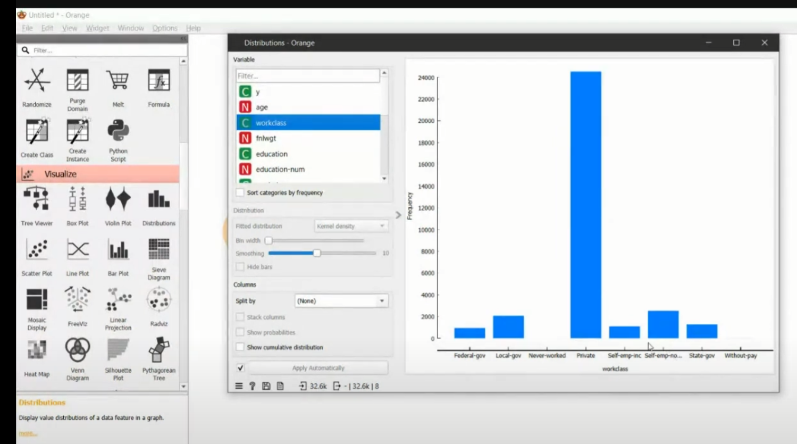
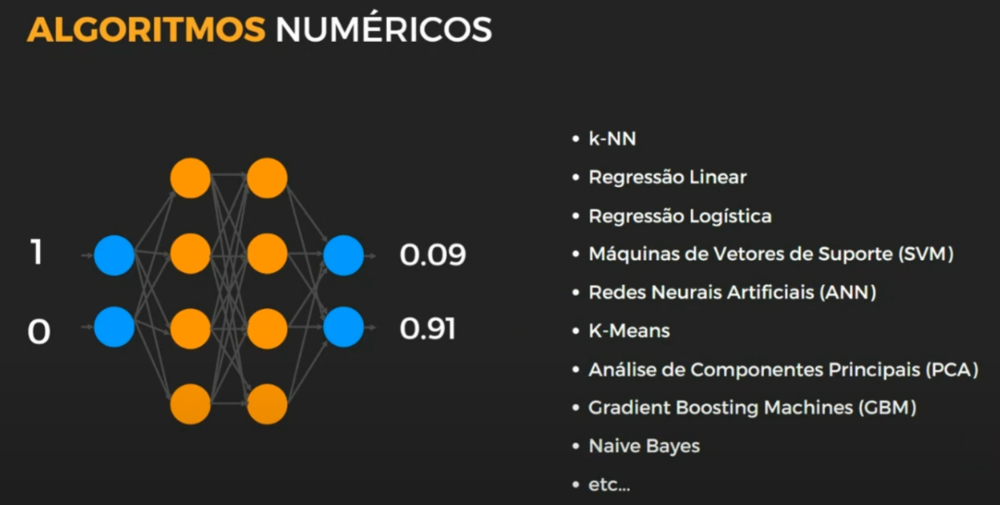
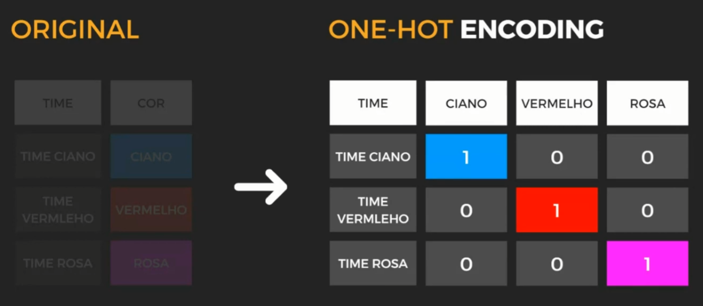
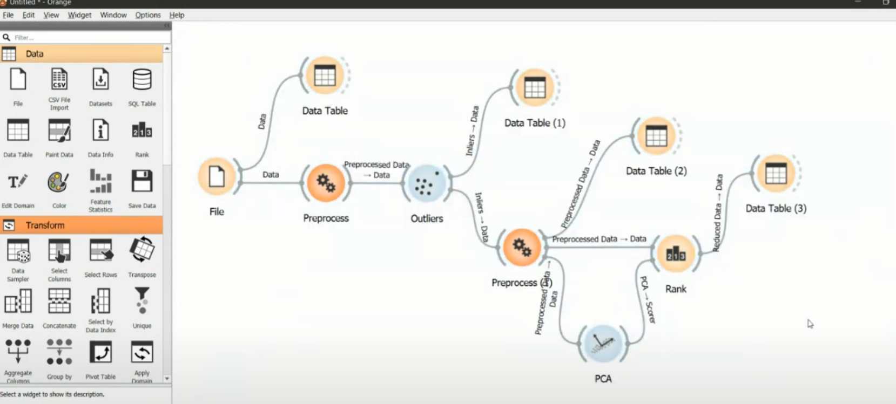

<h1>Ciência de Dados com Inteligência Artificial Visual com Orange Canvas</h1> 


> Status: ⚠️ (em desenvolvimento)

### Tópicos 

* [Descrição do Curso](#descrição-do-projeto)

* [Como Usar](#como-usar)

* [Pré-requisitos](#pre-requisitos)

* [Aula 01](#Aula-01)

* [Aula 02](#aula-02)
 
* [Trabalho: Caso de Uso](#trabalho-caso-de-uso)

* [Datasets Públicos](#Datasets-Públicos)

* [Referências](#referências)

* [Desenvolvedores / Contribuintes](#desenvolvedores)

* * *

## Descrição do Curso 

<p align="justify">
  Bem-vindos ao curso de Inteligência Artificial (IA) com Orange Canvas, uma jornada educativa projetada para desmistificar a IA e torná-la acessível a todos, independentemente do nível de experiência prévio. Sob a orientação experiente do professor Sandeco, este curso visa introduzir os conceitos fundamentais de IA, explorando como essa tecnologia revolucionária pode ser aplicada de maneira prática em diversos campos. Utilizando o Orange Canvas, uma ferramenta visual de programação para análise de dados, os participantes aprenderão a construir, testar e avaliar modelos de IA de forma intuitiva e interativa. Este curso é o ponto de partida ideal para quem deseja mergulhar no mundo da inteligência artificial, equipando os alunos com o conhecimento e as habilidades necessárias para explorar essa fascinante área.

Ao longo do curso, também dedicaremos um tempo para contextualizar a inteligência artificial dentro do panorama das revoluções industriais, destacando como a atual revolução da IA está moldando o futuro em uma velocidade sem precedentes. A descomplicação do conceito de IA será uma prioridade, garantindo que todos os participantes possam compreender e aplicar os princípios da inteligência artificial em seus projetos e carreiras. O professor Sandeco trará insights valiosos sobre as implicações éticas, sociais e econômicas da IA, preparando os alunos não apenas tecnicamente, mas também para pensar criticamente sobre os desafios e oportunidades que a IA apresenta no cenário global atual.

O curso será mistrado por aulas síncronas (online), trabalhos em grupos, questões, leitura do livro criado para o curso e outras atividades.

</p>


## Como Usar
Para explorar os recursos disponíveis neste repositório, você pode:

Clonar o repositório para sua máquina local usando:

```bash
git clone https://github.com/seu-usuario/seu-repositorio-de-data-science.git
```

* * *


## ⚙️ Pré-requisitos

⚠️ Livro: INTELIGÊNCIA ARTIFICIAL VISUAL COM ORANGE CANVAS - SANDECO MACEDO

⚠️ Assistir a vídeo aula: [MEUS DADOS estavam SUJOS e o CHATGPT LIMPOU](https://youtu.be/YrHjJn7ilzM)

* * *

## 👨🏼‍🏫 Aula 01
### Resumo
[//]: # (https://www.youtube.com/watch?v=JaXySE6DT_E)


[//]: # (https://www.youtube.com/watch?v=JaXySE6DT_E&t=0s)
- [00:00](#) 
 🧠 Introdução à Inteligência Artificial

  - Introdução ao curso de Inteligência Artificial com Orange Canvas.
  - Descomplicação do conceito de inteligência artificial para os participantes.
  - Explicação sobre as revoluções industriais e a atual revolução da inteligência artificial.

[//]: # (https://www.youtube.com/watch?v=JaXySE6DT_E&t=135s)
- [02:15](#) 🛢️ Dados: O Novo Petróleo

  - Comparação entre o valor do petróleo no passado e o valor dos dados na era digital.
  - Os dados como principal recurso das grandes empresas de tecnologia.
  - A importância do pré-processamento de dados para extrair valor deles na área de inteligência artificial.

[//]: # (https://www.youtube.com/watch?v=JaXySE6DT_E&t=336s)
- [05:36](#) 📊 Big Data e Seus Desafios

  - Explanação sobre o conceito de Big Data e sua enorme escala.
  - Os cinco "Vs" do Big Data: volume, variedade, velocidade, veracidade e valor.
  - Os desafios enfrentados ao lidar com grandes volumes de dados e como superá-los.

[//]: # (https://www.youtube.com/watch?v=JaXySE6DT_E&t=666s)
- [11:06](#) 💰 Investimento em Inteligência Artificial

  - O crescimento dos investimentos globais em inteligência artificial.
  - O impacto da IA em diversos setores profissionais e sua relevância crescente.
  - A necessidade de familiarização e preparo para o uso da inteligência artificial em diferentes áreas.

[//]: # (https://www.youtube.com/watch?v=JaXySE6DT_E&t=813s)
- [13:33](#) 🌐 Popularização da Inteligência Artificial

  - A importância de popularizar o conhecimento sobre inteligência artificial em diferentes campos profissionais e na sociedade.
  - Exemplos de como a IA pode impactar várias áreas, desde a medicina até a biblioteconomia.
  - O papel do especialista no centro das equipes de inteligência artificial e sua importância na resolução de problemas específicos.

[//]: # (https://www.youtube.com/watch?v=JaXySE6DT_E&t=1036s)
- [17:16](#) 🤖 Aprendizado de Máquina: Entrada de Dados

  - Comparação entre o paradigma de programação tradicional e o aprendizado de máquina.
  - Explicação sobre como o aprendizado de máquina utiliza os dados de entrada e as respostas para criar modelos preditivos.
  - Demonstração prática do uso de dados para prever resultados usando o Orange Canvas.

[//]: # (https://www.youtube.com/watch?v=JaXySE6DT_E&t=1143s)
- [19:03](#) 🚢 Análise de sobrevivência no Titanic

  - Conceito de "mulheres e crianças primeiro" aplicado na análise de dados do Titanic.
  - Utilização de dados de passageiros do Titanic para prever chances de sobrevivência.
  - Exemplos de análise de dados para determinar a probabilidade de sobrevivência com base em diferentes variáveis, como sexo, idade e classe.

[//]: # (https://www.youtube.com/watch?v=JaXySE6DT_E&t=1253s) 
- [20:53](#) 🧠 Objetivo da análise de dados

  - Distinção entre dados e respostas na análise de dados.
  - Objetivo de prever se um indivíduo sobreviverá ou não com base em dados.
  - Discussão sobre o papel da inteligência artificial na previsão de resultados com base em conjuntos de dados.

[//]: # (https://www.youtube.com/watch?v=JaXySE6DT_E&t=1349s) 
- [22:29](#) 🔄 Programação tradicional vs. Inteligência Artificial

  - Diferenças entre programação tradicional e abordagem de inteligência artificial na resolução de problemas.
  - Na programação tradicional, as regras são codificadas para gerar respostas, enquanto na IA, os modelos aprendem a partir dos dados para gerar previsões.
  - Explicação sobre como a IA cria regras implicitamente a partir dos dados de treinamento.

[//]: # (https://www.youtube.com/watch?v=JaXySE6DT_E&t=1447s)
- [24:07](#) 🧠 Salvar e utilizar regras de IA

  - Processo de salvar as regras aprendidas pela inteligência artificial.
  - Utilização das regras salvas em aplicações baseadas em IA ou machine learning.
  - Exemplo de como o Orange permite salvar e utilizar modelos de IA de forma prática.

[//]: # (https://www.youtube.com/watch?v=JaXySE6DT_E&t=1524s)
- [25:24](#) 🛠️ Desenvolvimento de aplicações de IA

  - Explicação sobre como desenvolver aplicações práticas utilizando IA.
  - Utilização do Orange como uma ferramenta para treinar modelos e desenvolver aplicações sem a necessidade de programação complexa.
  - Analogia entre o Orange e um ambiente de desenvolvimento para criar aplicações de IA.

[//]: # (https://www.youtube.com/watch?v=JaXySE6DT_E&t=1571s)
- [26:11](#) 📊 Importância da quantidade de dados na IA

  - Discussão sobre a influência da quantidade de dados no desempenho da IA.
  - Analogia entre a quantidade de dados e a experiência de um aluno em aprendizagem.
  - Explicação sobre como a IA melhora com mais dados, conforme definido por **Tom Mitchell**.

[//]: # (https://www.youtube.com/watch?v=JaXySE6DT_E&t=1657s)
- [27:37](#) 🧠 Aprendizagem com experiência e quantidade de dados

  - Conceito de aprendizagem de máquina como um processo que melhora com mais experiência e dados.
  - Analogia entre a aprendizagem de máquina e o processo de aprendizado de um aluno em uma disciplina.
  - Explicação sobre como a quantidade e a qualidade dos dados influenciam a acurácia da IA.

[//]: # (https://www.youtube.com/watch?v=JaXySE6DT_E&t=1802s)
- [30:02](#) 🛢️ Refino de dados na IA

  - Importância da qualidade dos dados na IA e sua analogia com o refino do petróleo.
  - Exploração sobre técnicas de refino de dados para melhorar a qualidade dos conjuntos de dados.
  - Anúncio sobre a abordagem detalhada do refino de dados na próxima aula.

[//]: # (https://www.youtube.com/watch?v=JaXySE6DT_E&t=1888s)
- [31:28](#) 📏 Avaliação da acurácia na IA

  - Discussão sobre a importância da avaliação da acurácia na IA.
  - Explicação sobre como a acurácia é medida na IA, utilizando uma analogia com uma prova.
  - Considerações sobre a taxa de erro e o processo de melhoria da IA através do aprendizado com erros.

[//]: # (https://www.youtube.com/watch?v=JaXySE6DT_E&t=1999s)
- [33:19](#) 💡 Fine tuning e especialização de IA

  - Definição de fine tuning na IA e sua aplicação em modelos pré-treinados, como o GPT.
  - Explicação sobre como o fine tuning permite adaptar modelos de IA a tarefas específicas, como textos de áreas especializadas.
  - Discussão sobre a necessidade de exposição a dados específicos para especialização de modelos de IA.

[//]: # (https://www.youtube.com/watch?v=JaXySE6DT_E&t=2318s)
- [38:38](#) 🛠️ No code e low code para agilidade no desenvolvimento de soluções:

  - O uso de ferramentas no code e low code, como o Orange Canvas, permite agilidade no desenvolvimento de soluções sem a necessidade de programação intensiva.
  - A abordagem foca na resolução do problema, independentemente da linguagem utilizada, desde que a solução seja eficaz.
  - Profissionais experientes também adotam essas ferramentas para otimizar seu tempo e lidar com múltiplas responsabilidades, como trabalho, estudo e vida pessoal.

[//]: # (https://www.youtube.com/watch?v=JaXySE6DT_E&t=2533s)
- [42:13](#) 🏠 Utilização de inteligência artificial para previsão de valores imobiliários:

  - A aplicação de inteligência artificial pode ser utilizada para prever o valor de imóveis, como no caso da previsão do preço de uma casa para venda.
  - Essa previsão é baseada em técnicas de regressão, onde os dados históricos são utilizados para criar um modelo que estime o preço de acordo com características específicas do imóvel.
  - A análise dos dados e a criação do modelo de previsão são fundamentais para entender e estimar corretamente os valores imobiliários.

[//]: # (https://www.youtube.com/watch?v=JaXySE6DT_E&t=2759s)
- [45:59](#) 🤖 Inteligência artificial como uma composição de conceitos simples:

  - A inteligência artificial pode ser entendida como uma combinação de conceitos simples que se interconectam para lidar com problemas complexos.
  - Mesmo que os detalhes internos envolvam álgebra linear, cálculo diferencial e outras áreas da matemática, compreender os conceitos básicos é essencial para entender o funcionamento da inteligência artificial.
  - A abordagem simplificada permite aos profissionais focarem na aplicação prática da inteligência artificial em diversos domínios, como reconhecimento de imagens e carros autônomos.

[//]: # (https://www.youtube.com/watch?v=JaXySE6DT_E&t=3467s)
  - [57:47](#) 📊 Melhorando a visualização dos dados no Orange Canvas:

    - Ajustando a distribuição de classes e sobreviventes para uma melhor compreensão.
    - Utilizando widgets de cor para representar diferentes variáveis de forma visual.
    - Demonstrações práticas de como corrigir e melhorar a apresentação dos dados para análise.

[//]: # (https://www.youtube.com/watch?v=JaXySE6DT_E&t=3611s)
- [01:00:11](#) 🔄 Manipulação de dados e análise visual detalhada:

  - Corrigindo a representação de variáveis como sexo e idade para uma análise mais precisa.
  - Explorando a distribuição das classes por sexo e sobrevivência para insights mais profundos.
  - Demonstração de como exportar e compartilhar visualizações de dados para análise posterior.

[//]: # (https://www.youtube.com/watch?v=JaXySE6DT_E&t=3847s)
- [01:04:07](#) 📊 Conectando com outras plataformas e análise de sentimentos:

  - Exploração de conexões com redes sociais como Twitter para análise de sentimentos.
  - Demonstração de como importar dados externos e realizar análises avançadas no Orange Canvas.
  - Discussão sobre a aplicação prática dessas análises em diferentes áreas, como marketing.

[//]: # (https://www.youtube.com/watch?v=JaXySE6DT_E&t=4720s)
  - [01:18:40](#) 💡 Previsão e influência de variáveis em um modelo preditivo:

    - A importância de utilizar dados históricos para fazer previsões.
    - Demonstração do processo de previsão em um modelo de rede neural.
    - A influência das variáveis de entrada no resultado da previsão.

[//]: # (https://www.youtube.com/watch?v=JaXySE6DT_E&t=4928s)
- [01:22:08](#) 🤖 Testando diferentes variáveis em um modelo preditivo:

  - Experimentação com diferentes variáveis de entrada em um modelo preditivo.
  - Demonstração do impacto das variáveis na probabilidade de sobrevivência.
  - Análise da combinação de classe, idade e sexo na previsão do resultado.

[//]: # (https://www.youtube.com/watch?v=JaXySE6DT_E&t=5333s)
- [01:28:53](#) 📊 Sobreacoplamento em modelos de inteligência artificial:

  - Explicação sobre o problema do sobreacoplamento em modelos de inteligência artificial.
  - Discussão sobre os problemas de overfitting e underfitting.
  - Abordagem sobre a importância de uma acurácia balanceada e realista nos modelos de IA.

[//]: # (https://www.youtube.com/watch?v=JaXySE6DT_E&t=5828s)
  - [01:37:08](#) 🖼️ Reconhecimento de objetos e detecção em tempo real:

    - Para identificar objetos em tempo real, como no exemplo de um scanner de aeroporto, é necessário treinar modelos de aprendizado de máquina.
    - A detecção em tempo real requer uma grande quantidade de imagens já anotadas.
    - É possível usar as próprias imagens da aplicação para treinar e melhorar os modelos de detecção.

[//]: # (https://www.youtube.com/watch?v=JaXySE6DT_E&t=6019s)
- [01:40:19](#) 📷 Desafios na detecção com imagens de baixa resolução:

  - A detecção em imagens de baixa resolução apresenta desafios significativos.
  - Alguns casos, como detecção de áreas desmatadas, podem exigir classificação de pixels individuais.
  - Mesmo com resolução baixa, é possível melhorar a acurácia do modelo de detecção com abordagens específicas.

[//]: # (https://www.youtube.com/watch?v=JaXySE6DT_E&t=6061s)
- [01:41:01](#) 📊 Utilização de dados para prevenção de crimes:

  - Dados estatísticos e socioeconômicos podem ser usados para prevenir crimes, como no caso do raio-x em aeroportos.
  - Agências de segurança podem utilizar informações comportamentais e demográficas para identificar potenciais criminosos.
  - O reconhecimento facial pode enfrentar desafios, especialmente com múltiplas identidades associadas a uma única pessoa.

## 📁 Aula 02
[//]: # (https://youtu.be/oKtPx9f6MZ4)

[//]: # (https://www.youtube.com/watch?v=oKtPx9f6MZ4&t=84s)

- [01:24](#) 📊 Introdução ao pré-processamento de dados usando o Orange Canvas.

  - Apresentação do conjunto de dados "Adult Income Dataset" para exemplificar o pré-processamento de dados.
  - Importância do pré-processamento de dados antes de aplicar técnicas de Inteligência Artificial.
  - Exemplos de irregularidades comuns em conjuntos de dados.

  O **pré-processamento de dados** é uma etapa crucial antes de aplicar técnicas de Inteligência Artificial (IA), sendo fundamental para o sucesso de projetos nessa área. Essa fase envolve uma série de procedimentos destinados a limpar, organizar e transformar os dados brutos em um formato adequado para análise, garantindo que os algoritmos de IA possam interpretá-los corretamente e extrair insights valiosos. A importância do pré-processamento de dados pode ser destacada em vários aspectos:

1. Melhoria da Qualidade dos Dados

Dados brutos frequentemente contêm erros, valores ausentes, duplicatas ou informações irrelevantes. O pré-processamento permite corrigir esses problemas, melhorando a qualidade dos dados. Dados limpos e de alta qualidade são essenciais para treinar modelos de IA com precisão, pois "lixo entra, lixo sai" (garbage in, garbage out) é um princípio bem conhecido na computação.

2. Normalização e Padronização

Diferentes escalas e formatos podem prejudicar a eficácia dos algoritmos de IA, especialmente aqueles baseados em distâncias, como k-means ou kNN, e algoritmos de otimização gradientes, como redes neurais. O pré-processamento inclui a normalização (ajuste da escala dos dados para um intervalo comum) e a padronização (ajuste da distribuição dos dados para ter média 0 e desvio padrão 1), facilitando a convergência mais rápida dos algoritmos durante o treinamento.

3. Redução de Dimensionalidade

Datasets com um grande número de variáveis (alta dimensionalidade) podem tornar os modelos de IA ineficientes e propensos ao overfitting, onde o modelo aprende o ruído nos dados de treinamento em vez de generalizar a partir deles. Técnicas de redução de dimensionalidade, como Análise de Componentes Principais (PCA), são usadas no pré-processamento para identificar e remover informações redundantes ou irrelevantes, simplificando o modelo sem perder insights valiosos.

4. Engenharia de Recursos

A transformação e criação de novos recursos (feature engineering) é uma parte vital do pré-processamento, permitindo a incorporação de conhecimento do domínio nos dados. Isso pode significar a transformação de variáveis temporais em características mais úteis, como dia da semana ou parte do dia, ou a combinação de várias variáveis em uma nova que ofereça uma visão mais profunda para o modelo de IA.

5. Balanceamento de Dados

Em muitos problemas de classificação, alguns rótulos podem ser muito mais frequentes do que outros, levando a modelos de IA que têm um desempenho pobre nas classes menos representadas. Técnicas de pré-processamento, como oversampling, undersampling ou a geração de dados sintéticos (SMOTE), podem ajudar a equilibrar o dataset, melhorando a capacidade do modelo de aprender sobre todas as classes.

Conclusão

O pré-processamento de dados é, portanto, uma etapa indispensável no pipeline de IA, diretamente ligado à eficácia e eficiência dos modelos resultantes. Investir tempo e recursos no pré-processamento não apenas melhora a qualidade dos insights obtidos, mas também pode significar economia de recursos computacionais e tempo, ao facilitar o treinamento e a convergência de modelos complexos de IA.

[//]: # (https://www.youtube.com/watch?v=oKtPx9f6MZ4&t=430s)
- [07:10](#) 🛠️ Análise exploratória e tratamento de dados ausentes.

  - Demonstração prática de como identificar e lidar com dados ausentes em um conjunto de dados.
  - Discussão sobre estratégias de imputação de dados ausentes, como imputação pela média, mediana ou moda.
  - Explanação sobre a importância de tratar dados ausentes para evitar distorções nos resultados da análise.

[//]: # (https://www.youtube.com/watch?v=oKtPx9f6MZ4&t=637s)
- [10:37](#) 🧮 Abordagens para imputação de dados e considerações sobre a distribuição dos dados.

  - Analogia da "Copa das Cores" para ilustrar a imputação de dados ausentes.
  - Discussão sobre a imputação pela média e sua utilidade em dados com distribuição normal.
  - Exploração de outras abordagens para imputação de dados, incluindo o uso de inteligência artificial para reconhecer padrões e realizar a imputação.



A solução 1 não é uma boa.


A solução 2 é razoável.



A solução 3 é melhor.

[//]: # (https://youtu.be/oKtPx9f6MZ4?t=1033s)
- [17:13](#) 🛠️ Pré-processamento de dados com o Orange Canvas

  - Explicação sobre como o Orange trata valores ausentes.
  - Demonstração do widget "preprocess" para imputação de valores ausentes.
  - Opções de imputação disponíveis: remover, atribuir valor aleatório, média, mediana ou moda.

  Média e mediana podem ser usados para valores numéricos, a moda é para tipo texto.
  Analisando a moda do workclass
  

[//]: # (https://youtu.be/oKtPx9f6MZ4?t=1267s)
- [21:07](#) 🎯 Importância da mediana na imputação de valores ausentes

  - Discussão sobre a importância da mediana em dados categóricos.
  - Analogia entre moda matemática e moda no contexto de tendências.
  - Explanação sobre como a mediana oferece uma métrica mais confiável em relação à média na presença de outliers.

Dados categóricos são um tipo de dado utilizado em estatística e análise de dados para representar características que podem ser divididas em categorias distintas, mas que não têm uma ordem ou magnitude inerente. No entanto, como você mencionou, os dados categóricos podem ser classificados em dois tipos principais: nominais e ordinais, dependendo de se as categorias têm ou não uma ordem ou hierarquia natural.

### Dados Categóricos Nominais

Os dados nominais representam categorias que não possuem uma ordem ou classificação específica. Eles são usados para rotular variáveis sem qualquer tipo de quantificação. Exemplos comuns de dados nominais incluem:

- **Tipos sanguíneos**: A, B, AB, O. Não existe uma ordem hierárquica entre os tipos sanguíneos; eles são simplesmente diferentes categorias.
- **Cores**: Vermelho, Azul, Verde. Assim como os tipos sanguíneos, as cores são categorias sem uma ordem específica.
- **Gênero**: Masculino, Feminino, Outros. Estas são categorias para classificar o gênero sem qualquer implicação de ordem.
- **Nacionalidade**: Brasileiro, Americano, Canadense, etc. As nacionalidades são outro exemplo de dados nominais, onde as categorias simplesmente representam diferentes grupos sem qualquer ordem.

### Dados Categóricos Ordinais

Diferentemente dos dados nominais, os dados ordinais possuem uma ordem ou hierarquia natural entre as categorias. Embora os dados ordinais mostrem uma sequência, a distância exata ou a diferença entre os níveis não é conhecida. Exemplos de dados ordinais incluem:

- **Tamanhos**: Pequeno, Médio, Grande. Essas categorias têm uma ordem natural, onde Grande é maior que Médio, que é maior que Pequeno.
- **Níveis de educação**: Ensino Fundamental, Ensino Médio, Graduação, Pós-graduação. Aqui, cada categoria representa um nível de educação que segue uma ordem específica de progressão.
- **Classificações de hotéis**: ★, ★★, ★★★, ★★★★, ★★★★★. As estrelas indicam uma classificação que tem uma ordem clara, com mais estrelas representando uma qualidade superior.
- **Níveis de satisfação**: Insatisfeito, Neutro, Satisfeito. Essas categorias representam uma escala de satisfação que tem uma ordem lógica de menos para mais satisfeito.

### Importância dos Dados Categóricos

Os dados categóricos são fundamentais em diversas análises estatísticas e modelos de machine learning, pois permitem a classificação e agrupamento de informações de maneira que possamos entender padrões, fazer previsões e tomar decisões baseadas em categorias específicas. No entanto, muitos algoritmos de machine learning requerem que os dados de entrada sejam numéricos, o que significa que os dados categóricos muitas vezes precisam ser transformados por meio de técnicas como codificação one-hot ou codificação de rótulos antes de serem utilizados para treinamento de modelos.

Entender a diferença entre dados nominais e ordinais é crucial para escolher o método de análise e de pré-processamento mais adequado, garantindo que a informação que a ordem das categorias carrega (no caso dos ordinais) seja preservada e utilizada corretamente nas análises.

[//]: # (https://youtu.be/oKtPx9f6MZ4?t=1511s)
- [25:11](#) 📊 Identificação e tratamento de outliers

  - Definição de outliers como anomalias nos dados.
  - Ilustração de outliers como dados que se destacam significativamente da maioria.
  - Abordagem de tratamento de outliers pelo Orange Canvas, incluindo exclusão ou imputação com base na mediana.


[//]: # (https://www.youtube.com/watch?v=oKtPx9f6MZ4&t=2179s)
- [36:19](#) 🧠 Pré-processamento de dados no Orange Canvas

  - Exploração do pré-processamento de dados com o Orange Canvas.
  
[//]: # (https://www.youtube.com/watch?v=oKtPx9f6MZ4&t=2287s)
- [38:07](#) 📊 Identificação e tratamento de dados categóricos

  - Discussão sobre o desafio de lidar com dados categóricos em machine learning.
  - Explanação sobre técnicas de transformação de dados categóricos, como One Hot Encoding.

A presença de uma grande quantidade de dados categóricos em um dataset pode, de fato, apresentar desafios significativos para análises estatísticas e modelos de machine learning. Isso ocorre porque muitos algoritmos são projetados para trabalhar com dados numéricos e podem ter dificuldades em lidar diretamente com variáveis categóricas, especialmente quando estas possuem muitas categorias. Além disso, um número elevado de categorias pode levar a problemas como a dimensionalidade excessiva, que pode, por sua vez, resultar em overfitting (quando o modelo se ajusta demais aos dados de treinamento e tem um desempenho ruim em dados novos) e aumentar a complexidade computacional. Para mitigar esses problemas, é importante considerar estratégias de tratamento e redução da quantidade de categorias categóricas. Aqui estão algumas técnicas e considerações para enriquecer a informação:

### Redução de Categorias

- **Agrupamento de Categorias**: Uma abordagem comum é agrupar categorias semelhantes em categorias mais amplas, reduzindo assim o número total de categorias. Por exemplo, em uma variável categórica que lista cidades, pode-se agrupar cidades pela região geográfica ou tamanho.

- **Remoção de Categorias Raras**: Categorias que aparecem muito raramente nos dados podem ser menos úteis para a análise e podem ser combinadas em uma categoria "Outros" ou simplesmente removidas, dependendo do caso de uso.

### Transformação de Dados Categóricos

- **Codificação**: Antes de aplicar técnicas como PCA (Análise de Componentes Principais), é necessário transformar variáveis categóricas em numéricas. Métodos como a codificação one-hot ou codificação ordinal são comumente utilizados, mas aumentam a dimensionalidade dos dados.

- **Análise de Componentes Principais (PCA) para Dados Categóricos**: Embora o PCA seja tradicionalmente aplicado a dados numéricos, variantes do PCA adaptadas para dados categóricos, como o Multiple Correspondence Analysis (MCA), podem ser utilizadas para reduzir a dimensionalidade de dados categóricos.

### Seleção de Recursos

- **Uso de RANK para Seleção de Recursos**: Técnicas de seleção de recursos, como métodos baseados em RANK, podem ajudar a identificar e manter as variáveis mais relevantes para o modelo. Isso não apenas reduz a complexidade do modelo, mas também pode melhorar o desempenho ao focar nas características mais informativas.

- **Importância de Recursos**: Além de técnicas automáticas, a análise da importância dos recursos oferecida por muitos modelos de machine learning pode fornecer insights sobre quais variáveis categóricas contribuem mais para a previsão, permitindo uma redução focada naquelas de menor importância.

### Considerações Finais

Ao lidar com dados categóricos, é crucial equilibrar a necessidade de preservar informações úteis com a necessidade de simplificar o modelo para evitar problemas como overfitting e alta complexidade computacional. A escolha das técnicas de pré-processamento e redução de dimensionalidade deve ser guiada pelo conhecimento do domínio e pelos objetivos específicos da análise ou modelo de machine learning em questão. Experimentar diferentes abordagens e avaliar seu impacto no desempenho do modelo são etapas essenciais para encontrar o equilíbrio adequado.


[//]: # (https://www.youtube.com/watch?v=oKtPx9f6MZ4&t=2897s)
- [48:17](#) 🛠️ Transformação de dados categóricos com One Hot Encoding

  - Detalhes sobre o uso de One Hot Encoding para transformar dados categóricos em formato adequado para modelos de machine learning.
  - Explicação do conceito de One Hot Encoding e sua aplicação prática em problemas de análise de dados.





[//]: # (https://youtu.be/oKtPx9f6MZ4?t=3400s)

- [56:40](#) 💡 Tratamento de dados categóricos e impacto no desempenho:

  - Trabalhar com muitas categorias pode degradar o desempenho dos modelos.
  - Ao modelar dados com várias categorias, é essencial considerar a quantidade de informações dentro de cada categoria.
  - O excesso de categorias pode resultar em ruído nos dados, afetando negativamente a eficácia dos modelos.

[//]: # (https://youtu.be/oKtPx9f6MZ4?t=3571s)
- [59:31](#) 📊 Utilizando Análise de Componentes Principais (PCA) para redução de dimensão:

  - O PCA é uma técnica útil para reduzir a dimensionalidade dos dados, preservando as características mais importantes.
  - Ao aplicar o PCA, é possível transformar um grande número de features em um conjunto menor de componentes principais.
  - A redução de dimensão com PCA facilita a visualização e o processamento dos dados, mantendo as informações mais relevantes.

[//]: # (https://youtu.be/oKtPx9f6MZ4?t=3780s)
- [01:03:00](#) 🛠️ Utilizando algoritmos de ranking para identificar features mais informativas:

  - Algoritmos de ranking ajudam a identificar quais features são mais informativas para o modelo.
  - Esses algoritmos classificam as features com base em sua importância para a predição do target.
  - A seleção das features mais informativas contribui para melhorar a eficácia dos modelos de machine learning.

Término da aula de pré-processamento.




## 📁 Aula 03
[//]: # (link da aula aqui)


## 📁 Aula 04
[//]: # (link da aula aqui)


## 📁 Dicas
Ao carregar os dados, um gráfico interessante é o de distribuição, para ver como estão os dados

WIN + SHIFT + S = Permite que o o Windows possa printar uma imagem, que pode ser colada no Chagpt para ele analisar.

Para dados categóricos é interessante usar a moda para "analisar"

0 = masculino - base titanic

## 🧐 Trabalhos / Casos de Uso

[//]: # (Explique com mais detalhes como a sua aplicação poderia ser utilizada. O uso de **gifs** aqui seria bem interessante. )

[//]: # (Exemplo: Caso a sua aplicação tenha alguma funcionalidade de login apresente neste tópico os dados necessários para acessá-la.)

### [Exercício 1.4](https://github.com/LuizPerciliano/Estudo-Ciencia-de-Dados/blob/main/Orange-Canvas/IA-Visual-2024-com-Sandeco/exercicios/1.4-EXERCICIOS.md)

Vídeo com a resolução do Exercício

[//]: # (https://youtu.be/G3jed9J1v6k)

## Datasets Públicos
Portal Brasileiro de Dados Abertos- http://dados.gov.br/dataset

Kaggle Datasets - https://www.kaggle.com/datasets

AWS Public Dataset Program - https://aws.amazon.com/opendata/public-datasets/

http://en.wikipedia.org/wiki/Wikipedia:Database_download

AWS Public Dataset Program - https://aws.amazon.com/opendata/public-datasets/

Google Cloud Public Datasets - https://cloud.google.com/public-datasets/

Registry of Research Data Repositories - https://www.re3data.org/ 

Wikipedia downloadable dataset – http://en.wikipedia.org/wiki/Wikipedia:Database_download

Million Song Dataset - https://labrosa.ee.columbia.edu/millionsong/

U.S. Government's open data - https://www.data.gov/

https://github.com/awesomedata/awesome-public-datasets


DataHub - https://datahub.io/ 

NYC Taxi & Limousine Commission Trip Record Data - http://www.nyc.gov/html/tlc/html/about/
trip_record_data.shtml

YFCC100M - https://multimediacommons.wordpress.com/yfcc100m-core-dataset/ 


## Referências
https://orangedatamining.com

https://github.com/sandeco/ORANGE_CANVAS


## 💼 Desenvolvedores / Contribuintes

|[<br><sub>Perciliano</sub>](https://github.com/LuizPerciliano) | [<br><sub>Sandeco</sub>](https://github.com/sandeco) |
| :---:  | :---: 

## Licença 

The [MIT License]() (MIT)

Copyright ©️ 2024 - Titulo do Projeto
