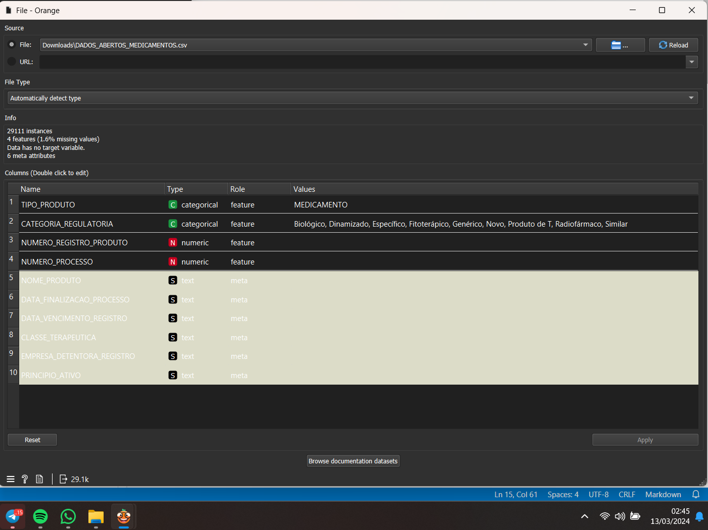
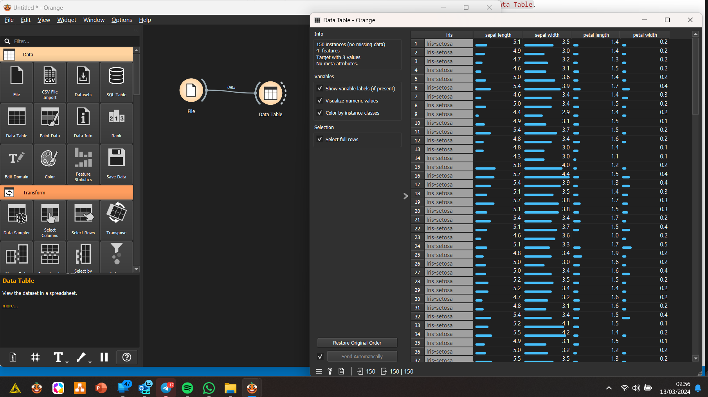
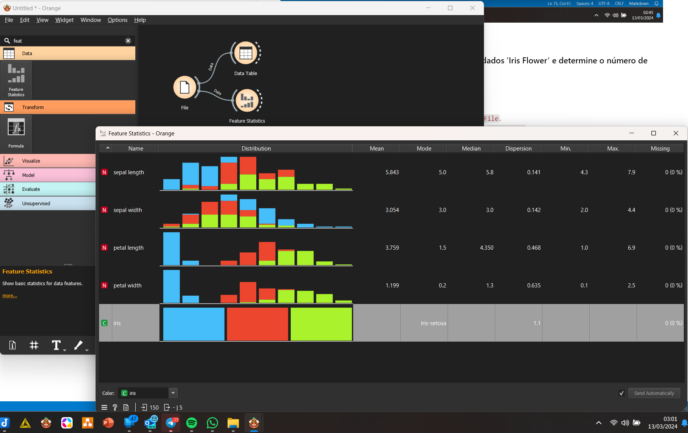
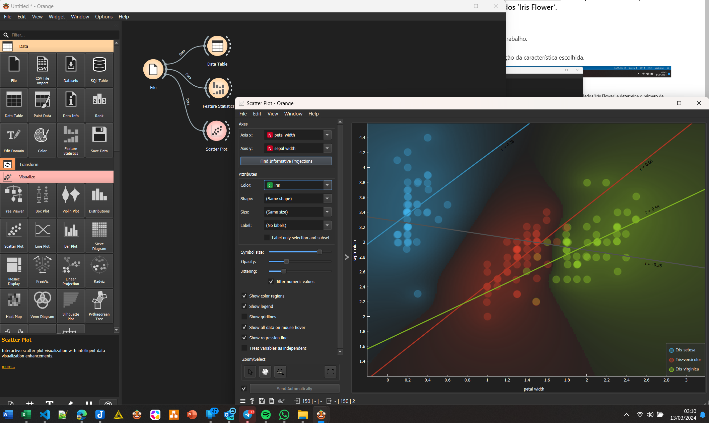
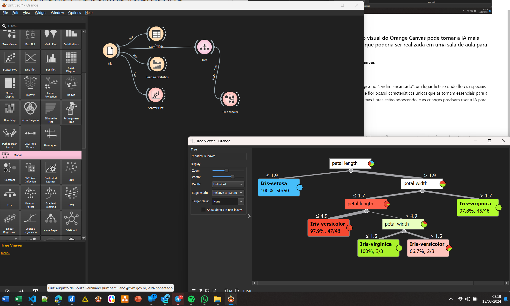

# Curso: Inteligência Artificial com Orange Canvas

## 👨🏻‍🏫 Professor | 🧑🏾‍🎓 Aluno

|[ Sandeco](https://github.com/sandeco) |[ Perciliano](https://github.com/LuizPerciliano) |
| :---:  | :---: 

***

# 1.4 EXERCÍCIOS (do livro)

## 1. Utilizando o widget `File`, carregue um conjunto de dados e identifique o tipo de cada variável (categórica, numérica, temporal ou textual).

**Instruções**:
- Abra o Orange Canvas e selecione o widget `File`.
- Carregue o conjunto de dados desejado.
- Examine as variáveis listadas no widget para identificar seus tipos.

Variáveis identificadas na figura acima.

## 2.  Com o widget `Data Table`, explore o conjunto de dados ’Iris Flower’ e determine o número de instâncias e variáveis presentes.

**Instruções**:
- Adicione o widget ``Data Table`` ao seu fluxo de trabalho.
- Carregue o conjunto de dados 'Iris Flower' utilizando o widget `File`.
- Observe o número de instâncias (linhas) e variáveis (colunas) no ``Data Table``.

Conforme imagem acima, são quatro variáveis e um target

## 3. Crie um histograma utilizando o widget `Feature Statistics` e interprete a distribuição de uma das características numéricas do conjunto de dados ’Iris Flower’.

**Instruções**:
- Insira o widget `Feature Statistics` no seu fluxo de trabalho.
- Selecione uma característica numérica para análise.
- Analise o histograma gerado para interpretar a distribuição da característica escolhida.

A feature sepal width, está com a distribuição normal mais aparente que as demais features, como uma calda a direita e com dados aparentemente parecendo outiliers deste mesmo lado. Assim como todas as features, não há valores missing. A média, moda e mediana são bem parecidas em torno de 3.0.

## 4. Utilize o widget `Scatter Plot` para visualizar a relação entre duas características do conjunto de dados ’Iris Flower’ e descreva qualquer padrão observado.

**Instruções**:
- Adicione o widget `Scatter Plot` ao seu fluxo de trabalho.
- Escolha duas características para análise.
- Observe o gráfico de dispersão gerado e descreva os padrões ou correlações observadas entre as duas características.

Nesta imagem temos a fronteira de decisão (região) entre as flores iris: setosa, virgínica e vesicolor. Com as duas variáveis selecionadas percebe-se nitidamente e visualmente que é possível perceber a diferença de cada flor, contudo, na região da versicolor e virgínica, percebe-se algumas semelhanças dessas.

## 5. Reflita sobre como o conceito de programação visual do Orange Canvas pode tornar a IA mais acessível e proponha uma atividade educacional que poderia ser realizada em uma sala de aula para crianças.

**Atividade: A Aventura do Jardim Encantado com Orange Canvas**

### Descrição da Atividade:
Nesta atividade, as crianças embarcarão em uma aventura mágica no "Jardim Encantado", um lugar fictício onde flores especiais com diferentes cores, formas e tamanhos crescem. Cada tipo de flor possui características únicas que as tornam essenciais para a saúde do jardim. No entanto, um mistério ronda o jardim: algumas flores estão adoecendo, e as crianças precisam usar a IA para descobrir por quê.

#### Materiais Necessários:
- Computadores com Orange Canvas instalado.
- Dados fictícios do "Jardim Encantado", incluindo características das flores como cor, tamanho, forma da pétala, etc.
- Fichas ou cartões com imagens das flores e suas características (opcional para atividade offline).

#### Passo a Passo:

1. **Introdução ao Jardim Encantado**: Comece com uma história cativante sobre o Jardim Encantado e como algumas flores começaram a adoecer misteriosamente. Explique que, usando a IA e o Orange Canvas, eles podem ajudar a salvar o jardim.

2. **Conhecendo as Flores**: Apresente as crianças aos diferentes tipos de flores do jardim através de fichas ou diretamente no Orange Canvas, mostrando suas características.

3. **Missão de Classificação**: Utilizando o widget `File` no Orange Canvas, carregue os dados do Jardim Encantado. Explique que cada flor tem características que as tornam únicas. Use o widget `Data Table` para visualizar os dados.

4. **Detective de Dados**: Introduza o conceito de análise de dados de forma simplificada. Peça às crianças para usarem o widget `Scatter Plot` para encontrar padrões ou diferenças entre as flores saudáveis e as adoecidas, explorando diferentes características (como cor e tamanho da pétala).

5. **Salvando o Jardim**: Com base nas observações, as crianças devem decidir quais características tornam uma flor mais propensa a adoecer. Utilize o widget `Feature Statistics` para ajudar nessa tarefa, analisando as distribuições das características.

6. **Criando um Modelo de IA**: Introduza uma atividade simplificada de modelagem usando o widget `Tree` para criar um modelo de classificação que possa "prever" se uma flor está saudável ou não, baseado em suas características.

7. **Reflexão e Criatividade**: Após a atividade prática, conduza uma discussão sobre como a IA ajudou a salvar o Jardim Encantado. Incentive as crianças a desenharem suas próprias flores "inteligentes" que poderiam viver no jardim, pensando em características que as tornariam resistentes a doenças.

#### Conclusão:
Esta atividade não apenas introduz conceitos básicos de IA e análise de dados de maneira acessível e divertida, mas também promove a importância da observação, do pensamento crítico e da criatividade. Ao final, as crianças terão não apenas aprendido sobre IA de forma prática, mas também contribuído para a história do Jardim Encantado, reforçando a ideia de que a tecnologia pode ser uma ferramenta poderosa para resolver problemas.

***

[↩️ Curso](https://github.com/LuizPerciliano/Estudo-Ciencia-de-Dados/tree/main/Orange-Canvas/IA-Visual-2024-com-Sandeco)