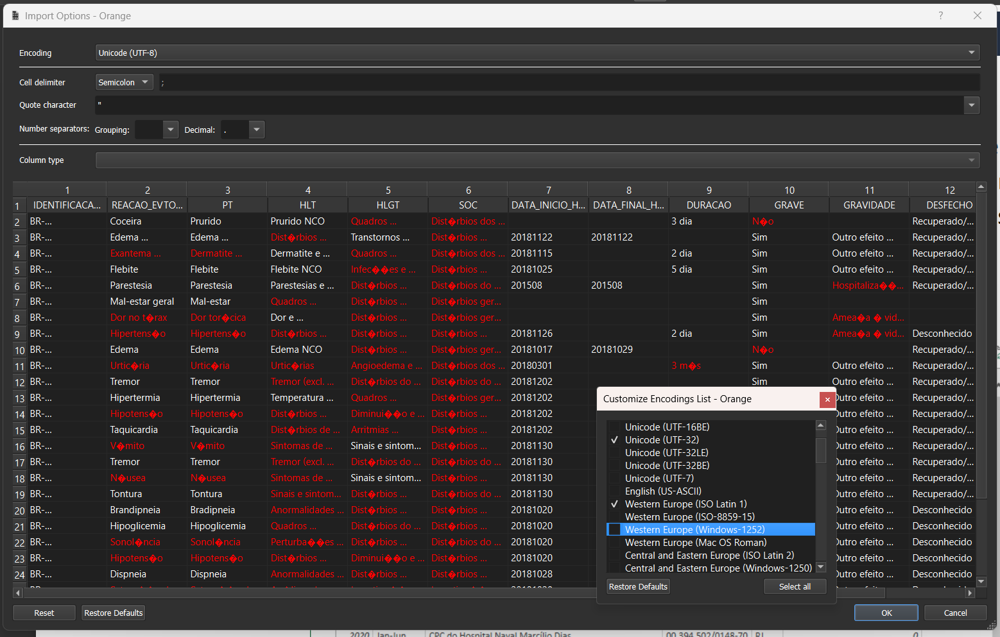
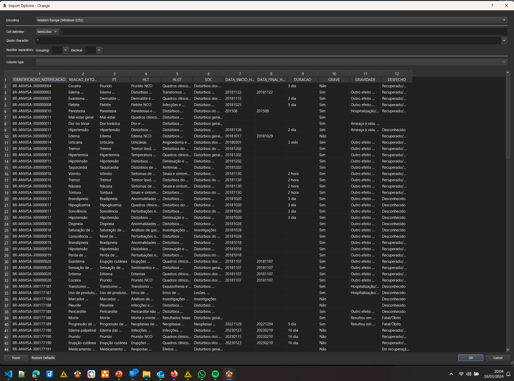
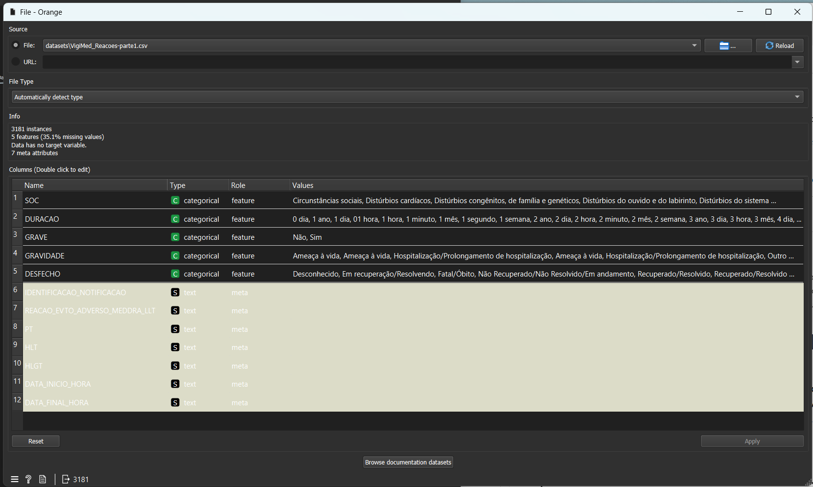
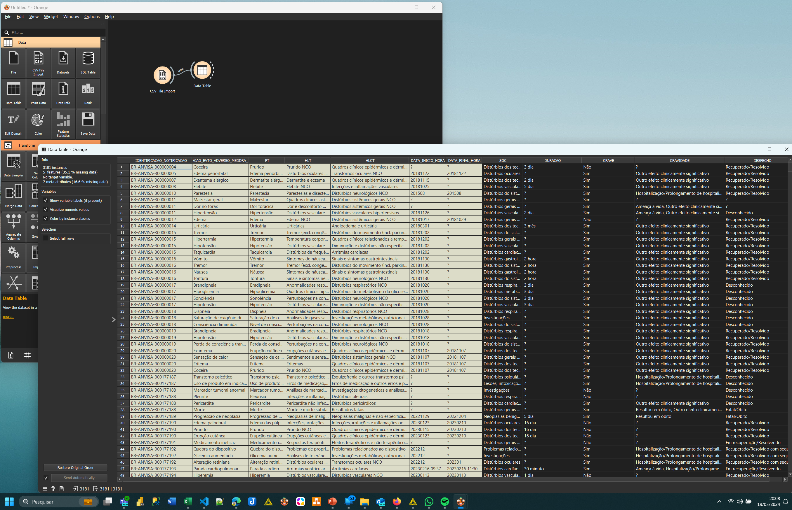
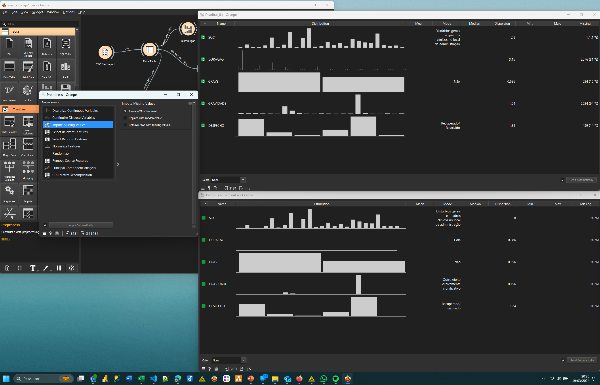
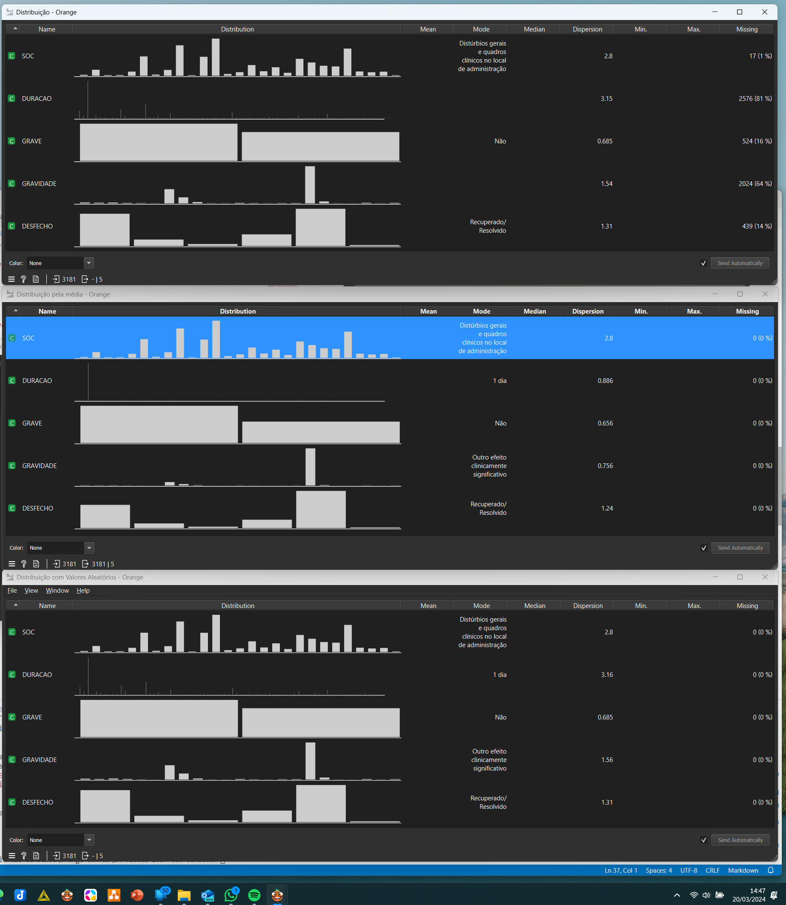
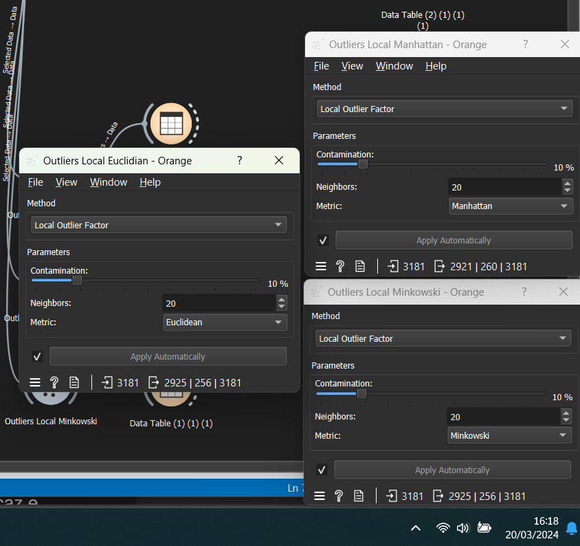
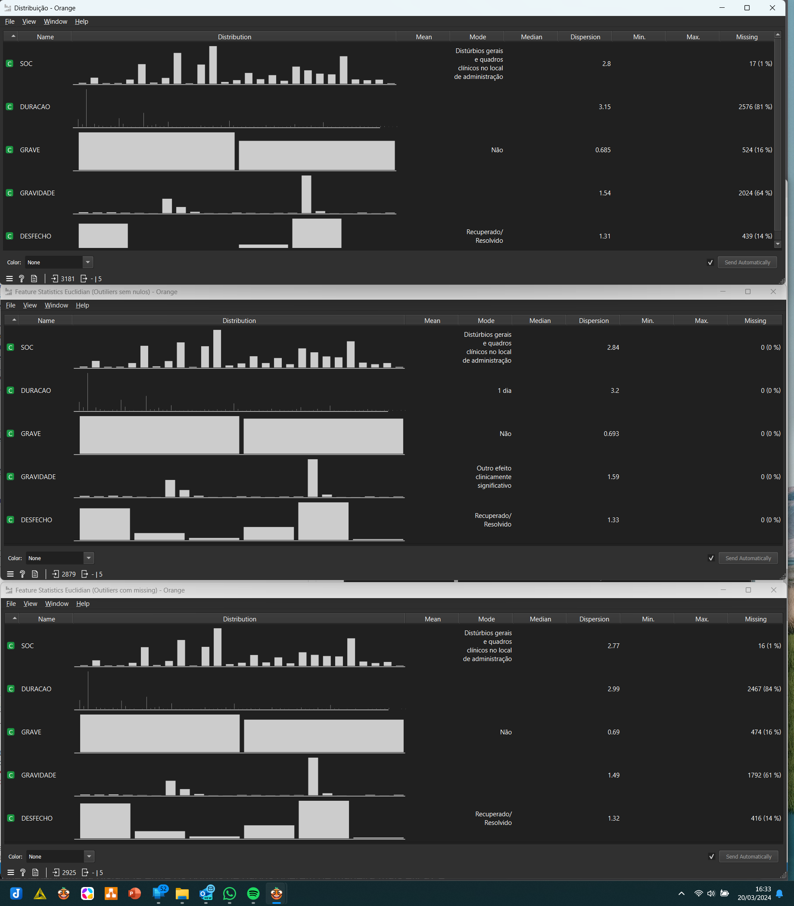

# Curso: Inteligência Artificial com Orange Canvas

> Exercícios do capítulo 2 do livro

## 👨🏻‍🏫 Professor | 🧑🏾‍🎓 Aluno

|[ Sandeco](https://github.com/sandeco) |[ Perciliano](https://github.com/LuizPerciliano) |
| :---:  | :---: 

***

## Base(s) de dados do exercício:
### Base de dados da ANVISA
Base disponível no Portal de Dados Abertos e também diretamente do portal de dados abertos da ANVISA.

**Link dos dados**: https://dados.anvisa.gov.br/dados/VigiMed_Reacoes.csv

**Link do dicionário de dados**: https://dados.anvisa.gov.br/dados/Documentacao_e_Dicionario_de_Dados_Farmacovigilancia.pdf

***

## Exercícios

### 1 - Tratamento de Valores Ausentes:
**Com um novo conjunto de dados carregado no Orange Canvas, utilize o widget Preprocess para abordar valores ausentes. Experimente diferentes métodos de imputação disponíveis no widget e compare os resultados. Discuta como cada método afetou a qualidade dos dados e sua potencial influência em análises futuras.**

Importação dos dados

Configuração para importação do Arquivo

Arquivo Reações a ser importado

Analisando tipos dos dados

Visualização dos dados

#### Comparando os resultados da técnica de substituição pela média

O primeiro método de imputação de valores ausentes foi utilizando a técnica  de substituição pela média (para variáveis contínuas) ou pelo valor mais frequente (para variáveis categóricas). É uma técnica básica, mas eficaz, que pode ser aplicada quando não se espera que a ausência dos dados esteja correlacionada com outras variáveis.

A figaura abaixo mostra as distribuições antes e depois dessa técnica.

#### Comparando os resultados da técnica de substituição apagando linhas que contém nulos
Essa técnica não foi interessante para essa base pois apagou xx% dos dados.

#### Comparando os resultados das técnicas
A técnica de substituir por Valor Aleatório da última imagem, a distribuição dos dados ficou mais parecida com os dados com valores nulos. Esta estratégia substitui os valores ausentes por um valor aleatório selecionado da distribuição dos dados existentes. Esta abordagem pode ser útil para manter a distribuição geral dos dados, especialmente em casos onde a remoção de linhas com valores ausentes resultaria na perda de uma grande parte do conjunto de dados.

Para este problema, eu usaria a estratégia de substitui os valores ausentes por um valor aleatório.

***

### 2 - Identificação e Tratamento de Outliers:
**Explore o widget Outliers para identificar e tratar outliers em um conjunto de dados. Aplique diferentes estratégias de detecção e avalie como a remoção ou ajuste dos outliers influencia a distribuição dos dados. Reflita sobre a importância de tratar outliers
antes de proceder com análises mais avançadas.**

O widget Outliers oferece várias metodologias para a detecção como: o One-Class SVM, Covariance Estimator, Local Outlier Factor e Isolation Forest, cada um com parâmetros específicos que podem ser ajustados para otimizar a detecção de outliers. O
Local Outlier Factor, por exemplo, é eficaz em conjuntos de dados de dimensão moderada, calculando um escore que reflete o grau de anormalidade das observações com base na densidade local em relação aos seus vizinhos. Já o Isolation Forest é indicado para conjuntos de dados de alta dimensão, isolando observações ao selecionar aleatoriamente um atributo e então um valor de divisão entre os valores máximo e mínimo desse atributo selecionado.

Para este caso foi usado o "Local Outlier Factor" com as métricas: Euclidian, Manhattan e Minkowski. A quantidade de registro excluídas de ambos são bem parecidas conforme imagem abaixo.

A imagem abaixo nos mostra que a distribuição não é muito diferente em relação aos dados reais sem tratamento, contudo, tratando os valores nulos, a distriuição dos outliers se assemelha mais com a distribuição padrão, logo, para este caso, faz sentido tratar os valores nulos antes dos outiliers primeiro.

***

### 3 - Normalização e Padronização de Dados:

**Utilize o widget Preprocess para normalizar e padronizar um conjunto de dados. Aplique ambos os métodos separadamente e juntos, observando as mudanças no conjunto de dados resultante. Analise o impacto dessas transformações na preparação dos dados para modelos de aprendizado de máquina.**

***

### 4 - Redução de Dimensionalidade com PCA:

**Aplique o widget PCA a um conjunto de dados carregado através do widget File. Ajuste o número de componentes principais para capturar uma certa porcentagem da variância explicada. Explore visualmente o impacto da redução de dimensionalidade nos dados e discuta como o PCA pode facilitar a análise e modelagem de dados complexos.**

***
[↩️ Curso](https://github.com/LuizPerciliano/Estudo-Ciencia-de-Dados/tree/main/Orange-Canvas/IA-Visual-2024-com-Sandeco)